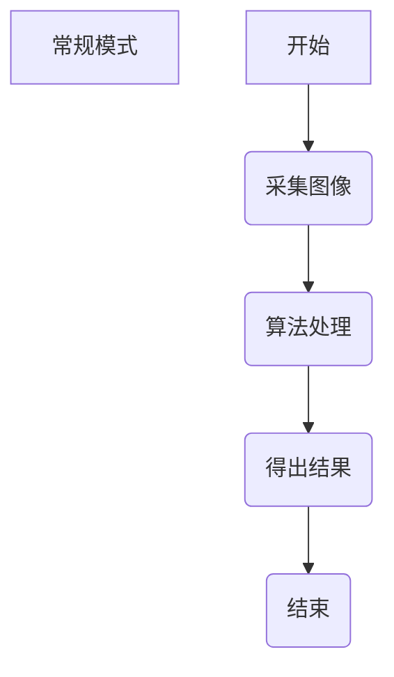

## 非标设备多相机流水线模式缓存图片(C/S客户端，c#开发语言)

	本文所说流水线方式下存储图像是在软件测量周期慢于图片周期前提下讲解的，如果软件一直在等待图片数据，逻辑就没有那么复杂。

1、非标设备项目，常规模式测量流程

常规模式下，相机采集图像信号由上位机控制（无论软触发、硬触发）。每个周期内的图像数据只对应一个产品，产品图像数据不会提前到来，这种情况下软件内部开辟一段连续地址空间用来存储相机数据，重复使用即可满足需求。

2、然而对于类似产线流水线方式来料的且相机采集图像信号由外部控制，软件没有去监听触发信号。这个时候就需要提前定义好每个产品对应多少张图片数据，软件内部从第一片产品开始计数，自动判断图像数据对应第几个产品。常规模式下的储存方式就没法满足需求。由此引出我们今天讲解的内容，流水线模式流程图如下：

相机存储模块不仅需要存储相机的数据还需要区分产品。不然不同产品图像数据错乱，测量结果就一直错下去了。

1、假如把产品编号顺序，以1,2,...,n为编号。那么当当前软件需要用的产品序号与图像数据所属产品序号之差≤X时(X是一个固定值)，图像数据存放在内存(内存缓存1)中；如果>X不存放在内存(内存缓存1)中。

2、定义一个生产者-消费者类，用来把图像数据写到磁盘中。

3、定义一个定时器，用来加载图像数据。判断产品序号与当前使用产品序号之差≤X且图像数据在内存(内存缓存1)中的找不到，就加载对应磁盘图片数据到内存中(内存缓存2)
